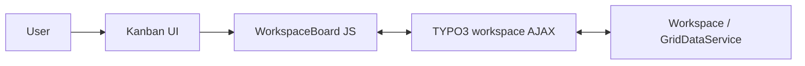

[](https://typo3.org/)
[](https://typo3.org/)
[](https://www.php.net/)
[](https://www.php.net/)
[](https://www.php.net/)
[](https://www.php.net/)
[](https://www.gnu.org/licenses/gpl-2.0.html)
[](https://docs.typo3.org/m/typo3/reference-coreapi/main/en-us/ExtensionArchitecture/DeclarationFile/Index.html)

# TYPO3 Extension `Kanban Workspaces`

> [!IMPORTANT]
> The extension is in an early experimental state and considered as `Proof-of-Concept (POC)`
> implementation and not everything is possible acting as smooth as expected or is finished.

|                  | URL                                                               |
|------------------|-------------------------------------------------------------------|
| **Repository:**  | https://github.com/web-vision/kanban-workspaces/                  |
| **Read online:** | https://docs.typo3.org/p/web-vision/kanban-workspaces/main/en-us/ |
| **TER:**         | https://extensions.typo3.org/extension/kanban_workspaces/         |

## Description

Kanban board backend module for TYPO3 CMS workspace management.

This extension provides a Kanban-style UI in the TYPO3 backend to manage workspace content (pages, `tt_content`) via
drag-and-drop, filters, and TYPO3 workspace APIs. Columns represent workspace stages; cards represent workspace records.
You can move items between stages, filter by depth/language/stage, search, and use the integrated “Send to stage” workflow.

## Features

- **Kanban board**: Columns = workspace stages; cards = workspace records (pages, content elements).
- **Drag-and-drop**: Move cards between stages; persists via `Actions::sendToSpecificStageExecute`.
- **Filters**: Depth (this page / 1–4 levels / infinite), language (system languages + “all”), stage. Filters are stored
  in module data and applied to the workspace API request.
- **Global search**: Search input in header; filters the card list.
- **Preview modal**: Card detail with “Summary of changes”, “Activity”, and “History” tabs; Revert / Approve actions.
  Uses TYPO3 diff data where available.
- **Send to stage**: Integration with `@typo3/workspaces/renderable/send-to-stage-form.js` for stage transitions
  (including optional recipients and comments).
- **Workspace-aware**: Requires a non-Live workspace and a selected page (`id`); shows an infobox when on Live or no
  page is selected.
- **Stage configuration**: Stages come from `WorkspaceStageRepository`; optional Extension Manager setting to hide
  default TYPO3 stages and use only custom ones.

## Compatibility

| Branch | Version   | TYPO3    | PHP                |
|--------|-----------|----------|--------------------|
| main   | 0.0.x-dev | v13, v14 | 8.2, 8.3, 8.4, 8.5 |

## Installation

### Composer

```bash
composer require web-vision/kanban-workspaces
```

### TypoScript

Include the static template **“Kanban Workspaces Backend Module”** (`Configuration/TypoScript` via `ext_tables.php`)
in the Install Tool or Template module.

### DDEV

If the project uses [DDEV](https://ddev.com/), run Composer and TYPO3 CLI commands inside the DDEV container
(e.g. `ddev composer install`, `ddev exec typo3 …`).

## Configuration

### Extension Manager

Configure in **Admin Tools → Extension Manager → kanban_workspaces** (or `ext_conf_template.txt`):

| Setting                      | Type    | Default | Description                                                                                                                                                                 |
|------------------------------|---------|---------|-----------------------------------------------------------------------------------------------------------------------------------------------------------------------------|
| `disableResetToEditingStage` | boolean | `0`     | When enabled, prevents TYPO3's DataHandler from resetting a workspace record's stage back to the editing stage (stage 0) after a field update, keeping its current stage. |

### TypoScript

Optional overrides for template/partial/layout paths and `storagePid` are available in [Configuration/TypoScript/constants.typoscript](Configuration/TypoScript/constants.typoscript).

---

## Usage

- **Location**: Backend → **Web** → **Kanban Workspaces** (module `web_kanbanworkspaces`, after *Web → Info*).
- **Access**: User-level (`access: user`), all workspaces (`workspaces: '*'`).

**Steps:**

1. Switch to a **non-Live** workspace (e.g. via the workspace selector in the backend).
2. Select a **page** in the page tree (the module receives the page `id`).
3. Open **Web → Kanban Workspaces**. The board loads workspace records for that page (depth, language, and stage from filters).
4. Use filters, search, drag-and-drop, card preview, and “Send to stage” as needed.

## Architecture

### Backend

- [KanbanWorkspacesController](Classes/Controller/KanbanWorkspacesController.php) `index` action renders the module.
- It builds stage config from `WorkspaceStageRepository`, system languages, and depth options.
- It injects `WorkspaceConfig` (JSON) and loads `@web-vision/kanban-workspaces/App.js`, the workspace send-to-stage form, and CSS.

### Frontend

The frontend is built as ES6 modules under `Resources/Public/JavaScript/`, import-mapped
to `@web-vision/kanban-workspaces/` (see [Configuration/JavaScriptModules.php](Configuration/JavaScriptModules.php)).
The former single-file `Workspace.js` has been split into a central orchestrator and focused collaborators:

- [App.js](Resources/Public/JavaScript/App.js): entrypoint. Enables horizontal drag-to-scroll, instantiates
  `WorkspaceBoard`, and wires application-level events (e.g. `card:moved` → POST to the workspace dispatch API).
- [WorkspaceBoard.js](Resources/Public/JavaScript/WorkspaceBoard.js): `WorkspaceBoard` class — the orchestrator.
  Owns the shared state (cards, stages, filters, selection, history) and the lifecycle wiring, and delegates the
  actual work to its collaborators, which reach shared state and each other through their `board` reference.

| Module                 | Path                                                                             | Responsibility                                                                        |
|------------------------|----------------------------------------------------------------------------------|---------------------------------------------------------------------------------------|
| `WorkspaceApi`         | [data/WorkspaceApi.js](Resources/Public/JavaScript/data/WorkspaceApi.js)         | AJAX transport over the workspace dispatch endpoint.                                  |
| `DataTransformer`      | [data/DataTransformer.js](Resources/Public/JavaScript/data/DataTransformer.js)   | Stateless transform of API payloads into card / comment / history / diff view models. |
| `BoardRenderer`        | [ui/BoardRenderer.js](Resources/Public/JavaScript/ui/BoardRenderer.js)           | Columns, cards and filter-sidebar markup.                                             |
| `DragController`       | [ui/DragController.js](Resources/Public/JavaScript/ui/DragController.js)         | Drag-and-drop, drop placeholders, stage-transition start.                             |
| `ModalController`      | [ui/ModalController.js](Resources/Public/JavaScript/ui/ModalController.js)       | Preview and Send-to-Stage modals; revert / approve workflow.                          |
| `FilterController`     | [ui/FilterController.js](Resources/Public/JavaScript/ui/FilterController.js)     | Search and filter handling, persistence and reloads.                                  |
| `CardActions`          | [ui/CardActions.js](Resources/Public/JavaScript/ui/CardActions.js)               | Card context-menu actions (preview, edit, assign, discard, move/revert).              |
| `EventEmitter`         | [core/EventEmitter.js](Resources/Public/JavaScript/core/EventEmitter.js)         | Minimal pub/sub used for the board's custom events.                                   |
| `initHorizontalScroll` | [core/HorizontalScroll.js](Resources/Public/JavaScript/core/HorizontalScroll.js) | Drag-to-scroll behaviour for the board.                                               |
| utilities              | [core/utils.js](Resources/Public/JavaScript/core/utils.js)                       | Stateless helpers (HTML escaping, dates, icons, toasts, debounce).                    |

### APIs

- **Fetch**: `ajax/workspace` dispatch, `RemoteServer::getWorkspaceInfos` with `id`, `depth`, `language`, `stage`, etc.
- **Move**: `Actions::sendToSpecificStageExecute` with `affects.elements` and `nextStage`.

### Data flow



---

## API integration

**Summary:**

- **getWorkspaceInfos**: Request fields include `id`, `depth`, `language`, `stage`, etc.; response in `result.data`.
- **sendToSpecificStageExecute**: Payload with `affects.elements` (table, uid, t3ver_oid) and `nextStage`.
- **Language fallback**: A PSR-14 `WorkspaceLanguageFallbackListener` substitutes `"all"` for any empty/null `language.title` in the workspace grid, so records whose `sys_language_uid` is no longer present in the site configuration still render with a label.

---

## Development and testing

### JavaScript

- Entrypoint: [App.js](Resources/Public/JavaScript/App.js); orchestrator: [WorkspaceBoard.js](Resources/Public/JavaScript/WorkspaceBoard.js);
  collaborators under `core/`, `data/` and `ui/` (see the [Frontend](#frontend) architecture table).
- All modules live under `Resources/Public/JavaScript/`; import map `@web-vision/kanban-workspaces/` is defined
  in [Configuration/JavaScriptModules.php](Configuration/JavaScriptModules.php).

### Debug / events

The board communicates through the `EventEmitter` ([core/EventEmitter.js](Resources/Public/JavaScript/core/EventEmitter.js)).
Subscribe via `workspaceBoard.on('<event>', handler)` to observe its lifecycle and interactions, e.g.:

- `board:initialized`, `board:rendered`, `board:destroyed` – board lifecycle.
- `data:loaded` – workspace records fetched and transformed.
- `card:moved`, `card:drop`, `card:dragstart`, `card:dragend`, `card:click` – card interactions.
- `filter:change`, `filter:clear`, `search:change`, `search:clear` – filter / search changes.

Set the `mockData` option (in [App.js](Resources/Public/JavaScript/App.js)) to `true` to render the board from
`window.WorkspaceConfig.mockData` instead of the live API. These require the Kanban board to be initialised on the current page.

---

## Project structure

```
Classes/
├── Controller/KanbanWorkspacesController.php
├── Configuration/EmConfiguration.php
└── EventListener/   (AfterDataGeneratedForWorkspaceEvent, publish cleanup, language fallback)
Configuration/
├── Backend/Modules.php
├── JavaScriptModules.php
├── Services.yaml
└── TypoScript/
    ├── constants.typoscript
    └── setup.typoscript
Resources/
├── Private/   (Templates, Layouts, Language)
└── Public/    (JavaScript, Css, Icons, Documentation)
ext_emconf.php, ext_localconf.php, ext_tables.php, ext_conf_template.txt
```

---

## Troubleshooting

| Issue                                                  | What to check                                                                                                                                                      |
|--------------------------------------------------------|--------------------------------------------------------------------------------------------------------------------------------------------------------------------|
| “You’re on live workspace” / “Please select workspace” | Switch to a non-Live workspace in the backend.                                                                                                                     |
| Board empty or no data                                 | Ensure a page is selected in the page tree (`id` is set).                                                                                                          |
| Module not visible                                     | Include the “Kanban Workspaces Backend Module” TypoScript template. Check user/group permissions and `workspaces` access.                                          |
| JS errors / API failures                               | Verify `workspace_dispatch` (and related) AJAX URLs. Check browser console and network tab; ensure `EXT:workspaces` is installed and workspace APIs are available. |

---

## Funding Partner

The following companies have already pledged funding for the Kanban Workspace module for TYPO3.


<table border="0" cellspacing="0" cellpadding="8">
  <tr>
    <td align="center"></td>
    <td align="center"></td>
  </tr>
  <tr>
    <td align="center"></td>
    <td align="center"></td>
  </tr>
  <tr>
    <td align="center"></td>
    <td align="center"></td>
  </tr>
  <tr>
    <td align="center"></td>
    <td></td>
  </tr>
</table>

---
<br/>
<br/>

## Create a release (maintainers only)

Prerequisites:

* git binary
* ssh key allowed to push new branches to the repository
* GitHub command line tool `gh` installed and configured with user having permission to create pull requests.

**Prepare release locally**

> Set `RELEASE_BRANCH` to branch release should happen, for example: 'main'.
> Set `RELEASE_VERSION` to release version working on, for example: '1.0.0'.

```bash
echo '>> Create release based on configuration' ; \
  RELEASE_BRANCH='main' ; \
  RELEASE_VERSION="0.0.1"
  DEV_VERSION="0.0.2"
  echo ">> Checkout branches" && \
  git checkout main && \
  git fetch --all && \
  git pull --rebase && \
  git checkout ${RELEASE_BRANCH} && \
  git pull --rebase && \
  echo ">> Create release ${RELEASE_VERSION}" && \
  git checkout -b release-${RELEASE_VERSION} && \
  sed -i "s/^COMPOSER_ROOT_VERSION.*/COMPOSER_ROOT_VERSION=\"${RELEASE_VERSION}\"/" Build/Scripts/runTests.sh && \
  sed -i "s/^  RELEASE_VERSION.*/  RELEASE_VERSION=\"${RELEASE_VERSION}\"/" README.md && \
  sed -i "s/^  DEV_VERSION.*/  DEV_VERSION=\"${DEV_VERSION}\"/" README.md && \
  tailor set-version ${RELEASE_VERSION} && \
  composer config "extra"."typo3/cms"."version" "${RELEASE_VERSION}" && \
  echo "${RELEASE_VERSION}" > VERSION && \
  git add . && \
  git commit -m "[RELEASE] ${RELEASE_VERSION}" && \
  git push --set-upstream origin release-${RELEASE_VERSION} && \
  gh pr create --fill --base ${RELEASE_BRANCH} --title "[RELEASE] ${RELEASE_VERSION}" && \
  sleep 10 && \
  gh pr checks --watch --interval 2 && \
  sleep 10 && \
  gh pr merge -rd --admin && \
  git remote prune origin && \
  git tag ${RELEASE_VERSION} && \
  git push origin ${RELEASE_VERSION} && \
  echo ">> Post-release - set dev version: ${DEV_VERSION}-dev" && \
  git checkout -b set-version-${DEV_VERSION} && \
  sed -i "s/^COMPOSER_ROOT_VERSION.*/COMPOSER_ROOT_VERSION=\"${DEV_VERSION}-dev\"/" Build/Scripts/runTests.sh && \
  tailor set-version ${DEV_VERSION} && \
  composer config "extra"."typo3/cms"."version" "${DEV_VERSION}-dev" && \
  echo "${DEV_VERSION}-dev" > VERSION && \
  git add . && \
  git commit -m "[TASK] Set dev version ${DEV_VERSION}" && \
  git push --set-upstream origin set-version-${DEV_VERSION} && \
  gh pr create --fill --base ${RELEASE_BRANCH} --title "[TASK] Set dev version \"${DEV_VERSION}-dev\"" && \
  sleep 10 && \
  gh pr checks --watch --interval 2 && \
  sleep 10 && \
  gh pr merge -rd --admin && \
  git remote prune origin
```
