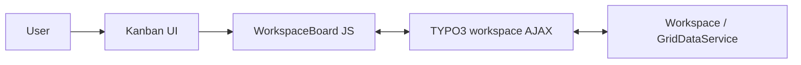

# Kanban Workspaces

[](https://typo3.org/)
[](https://www.php.net/)
[](https://www.gnu.org/licenses/gpl-2.0.html)
[](https://docs.typo3.org/m/typo3/reference-coreapi/main/en-us/ExtensionArchitecture/DeclarationFile/Index.html)

Kanban board backend module for TYPO3 CMS workspace management.

This extension provides a Kanban-style UI in the TYPO3 backend to manage workspace content (pages, `tt_content`) via drag-and-drop, filters, and TYPO3 workspace APIs. Columns represent workspace stages; cards represent workspace records. You can move items between stages, filter by depth/language/stage, search, and use the integrated “Send to stage” workflow.

---

## Features

- **Kanban board**: Columns = workspace stages; cards = workspace records (pages, content elements).
- **Drag-and-drop**: Move cards between stages; persists via `Actions::sendToSpecificStageExecute`.
- **Filters**: Depth (this page / 1–4 levels / infinite), language (system languages + “all”), stage. Filters are stored in module data and applied to the workspace API request.
- **Global search**: Search input in header; filters the card list.
- **Preview modal**: Card detail with “Summary of changes”, “Activity”, and “History” tabs; Revert / Approve actions. Uses TYPO3 diff data where available.
- **Send to stage**: Integration with `@typo3/workspaces/renderable/send-to-stage-form.js` for stage transitions (including optional recipients and comments).
- **Workspace-aware**: Requires a non-Live workspace and a selected page (`id`); shows an infobox when on Live or no page is selected.
- **Stage configuration**: Stages come from `WorkspaceStageRepository`; optional Extension Manager setting to hide default TYPO3 stages and use only custom ones.

---

## Requirements

- **TYPO3**: 13.4.x
- **PHP**: 8.2–8.3
- **Extensions**: `typo3/cms-workspaces` (required). Backend, Extbase, and Fluid are used as per `composer.json`.

---

## Installation

### Composer

```bash
composer require webvision/kanban-workspaces
```

If you use the project’s path repository (e.g. `./packages/*`), require via that package name instead:

```bash
composer require devzspace/kanban-workspaces
```

### TypoScript

Include the static template **“Kanban Workspaces Backend Module”** (`Configuration/TypoScript` via `ext_tables.php`) in the Install Tool or Template module.

### DDEV

If the project uses [DDEV](https://ddev.com/), run Composer and TYPO3 CLI commands inside the DDEV container (e.g. `ddev composer install`, `ddev exec typo3 …`).

---

## Configuration

### Extension Manager

Configure in **Admin Tools → Extension Manager → kanban_workspaces** (or `ext_conf_template.txt`):

| Setting | Type | Description |
|--------|------|-------------|
| `disableDefaultStage` | boolean | Exclude default stages from the Kanban board; only custom stages (uid ≥ 1) are shown when enabled. |
| `defaultStageId` | int | Used by `AfterDataGeneratedForWorkspaceEventListener` when overriding the stage for new workspace data. |

### TypoScript

Optional overrides for template/partial/layout paths and `storagePid` are available in [Configuration/TypoScript/constants.typoscript](Configuration/TypoScript/constants.typoscript).

---

## Usage

- **Location**: Backend → **Web** → **Kanban Workspaces** (module `web_kanbanworkspaces`, after *Web → Info*).
- **Access**: User-level (`access: user`), all workspaces (`workspaces: '*'`).

**Steps:**

1. Switch to a **non-Live** workspace (e.g. via the workspace selector in the backend).
2. Select a **page** in the page tree (the module receives the page `id`).
3. Open **Web → Kanban Workspaces**. The board loads workspace records for that page (depth, language, and stage from filters).
4. Use filters, search, drag-and-drop, card preview, and “Send to stage” as needed.

---

## Architecture

### Backend

- [KanbanWorkspacesController](Classes/Controller/KanbanWorkspacesController.php) `index` action renders the module.
- It builds stage config from `WorkspaceStageRepository` (and the “disable default stages” EM setting), system languages, and depth options.
- It injects `WorkspaceConfig` (JSON) and loads `@webvision/kanban-workspaces/App.js`, the workspace send-to-stage form, and CSS.

### Frontend

- [App.js](Resources/Public/JavaScript/App.js) instantiates `WorkspaceBoard` ([Workspace.js](Resources/Public/JavaScript/Workspace.js)) and wires events (e.g. `card:moved` → POST to the workspace dispatch API).
- [Workspace.js](Resources/Public/JavaScript/Workspace.js): `WorkspaceBoard` class handles fetch, transform, render, drag-and-drop, filters, search, modal, and API calls.

### APIs

- **Fetch**: `ajax/workspace` dispatch, `RemoteServer::getWorkspaceInfos` with `id`, `depth`, `language`, `stage`, etc.
- **Move**: `Actions::sendToSpecificStageExecute` with `affects.elements` and `nextStage`.

### Events

- [AfterDataGeneratedForWorkspaceEventListener](Classes/EventListener/AfterDataGeneratedForWorkspaceEventListener.php) subscribes to `AfterDataGeneratedForWorkspaceEvent`; it can override the stage and update the DB when `defaultStageId` is used.

### Data flow



---

## API integration

**Summary:**

- **getWorkspaceInfos**: Request fields include `id`, `depth`, `language`, `stage`, etc.; response in `result.data`.
- **sendToSpecificStageExecute**: Payload with `affects.elements` (table, uid, t3ver_oid) and `nextStage`.
- **Language fallback**: A PSR-14 `WorkspaceLanguageFallbackListener` substitutes `"all"` for any empty/null `language.title` in the workspace grid, so records whose `sys_language_uid` is no longer present in the site configuration still render with a label.

---

## Development and testing

### JavaScript

- Entrypoint: [App.js](Resources/Public/JavaScript/App.js); core logic: [Workspace.js](Resources/Public/JavaScript/Workspace.js).
- Both live under `Resources/Public/JavaScript/`; import map `@webvision/kanban-workspaces/` is defined in [Configuration/JavaScriptModules.php](Configuration/JavaScriptModules.php).

### Debug / tests

After the board is loaded, you can use console helpers described in the API doc:

- `testWorkspaceAPI()` – test workspace API integration
- `testRealApiResponse()` – test with real API response data
- `loadApiTests()` – load additional test utilities
- `reloadWorkspaceData()` – reload data from the API
- `testAPIResponseTransformation()`, `testEdgeCases()` (after `loadApiTests()`)

These require the Kanban board to be initialised on the current page.

---

## Project structure

```
Classes/
├── Controller/KanbanWorkspacesController.php
├── Domain/Model/Dto/EmConfiguration.php
└── EventListener/AfterDataGeneratedForWorkspaceEventListener.php
Configuration/
├── Backend/Modules.php
├── JavaScriptModules.php
├── Services.yaml
└── TypoScript/
    ├── constants.typoscript
    └── setup.typoscript
Resources/
├── Private/   (Templates, Layouts, Language)
└── Public/    (JavaScript, Css, Icons, Documentation)
ext_emconf.php, ext_localconf.php, ext_tables.php, ext_conf_template.txt
```

---

## Troubleshooting

| Issue | What to check |
|-------|----------------|
| “You’re on live workspace” / “Please select workspace” | Switch to a non-Live workspace in the backend. |
| Board empty or no data | Ensure a page is selected in the page tree (`id` is set). |
| Module not visible | Include the “Kanban Workspaces Backend Module” TypoScript template. Check user/group permissions and `workspaces` access. |
| JS errors / API failures | Verify `workspace_dispatch` (and related) AJAX URLs. Check browser console and network tab; ensure `EXT:workspaces` is installed and workspace APIs are available. |

---

## Funding Partner

The following companies have already pledged funding for the Kanban Workspace module for TYPO3.


<table border="0" cellspacing="0" cellpadding="8">
  <tr>
    <td align="center"></td>
    <td align="center"></td>
  </tr>
  <tr>
    <td align="center"></td>
    <td align="center"></td>
  </tr>
  <tr>
    <td align="center"></td>
    <td align="center"></td>
  </tr>
  <tr>
    <td align="center"></td>
    <td></td>
  </tr>
</table>

---
<br/>
<br/>
